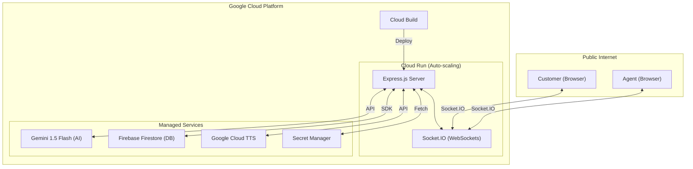

# AgentOS — Master Documentation
*The Unified AI Co-Pilot for Inbound Contact Centers*

---

## 🌐 Quick Access Links

Easily access the platform across different environments.

### 🚀 Production (Live)
- **Main Dashboard:** [agent-success-utsa5eayma-uc.a.run.app](https://agent-success-utsa5eayma-uc.a.run.app)
- **🎤 Voice Agent Interface:** [agent-success-utsa5eayma-uc.a.run.app/voice](https://agent-success-utsa5eayma-uc.a.run.app/voice)
- **⚙️ Admin Configuration:** [agent-success-utsa5eayma-uc.a.run.app/admin](https://agent-success-utsa5eayma-uc.a.run.app/admin)
- **💬 Customer Chat Widget:** [agent-success-utsa5eayma-uc.a.run.app/customer](https://agent-success-utsa5eayma-uc.a.run.app/customer)

### 💻 Local Development
- **Main Dashboard:** [localhost:3005](http://localhost:3005)
- **Voice Agent:** [localhost:3005/voice](http://localhost:3005/voice)
- **Admin Panel:** [localhost:3005/admin](http://localhost:3005/admin)
- **Customer Chat:** [localhost:3005/customer](http://localhost:3005/customer)
- **Voice Customer:** [localhost:3005/voice/customer](http://localhost:3005/voice/customer)

---

## 📖 Table of Contents
1. [Product Overview](#1-product-overview)
2. [Pricing & ROI](#2-pricing--roi)
3. [Inbound Call Journey & AI Coaching](#3-inbound-call-journey--ai-coaching)
4. [Feature List](#4-feature-list)
5. [Knowledge Assist (RAG)](#5-knowledge-assist-rag)
6. [System Architecture](#6-system-architecture)
7. [Tech Stack](#7-tech-stack)
8. [Local Setup](#8-local-setup)
9. [GCP Deployment](#9-gcp-deployment)
10. [Admin Configuration Guide](#10-admin-configuration-guide)
11. [FAQ](#11-faq)
12. [Pitch Q&A](#12-pitch-qa)

---

## 1. Product Overview

**AgentOS** is a real-time AI coaching platform for **inbound call center agents**. It acts as a silent AI co-pilot that reads conversation transcripts in real time and provides instructions, empathy alerts, and smart replies to ensure every customer interaction is professional and compliant.

### The Problem It Solves
- **Agent Skill Gaps:** Turns new hires into experts on day one.
- **Script Compliance:** Ensures identity verification and empathy are never skipped.
- **Average Handle Time (AHT):** Smart suggestions reduce thinking time.

---

## 2. Pricing & ROI

### Pricing Tiers
| Tier | Price | Features |
|---|---|---|
| **Free** | $0/mo | 2 Agents, 100 calls/mo, Basic coaching |
| **Pro** | $45/agent/mo | Unlimited calls, Custom prompts, 7-day retention |
| **Enterprise** | Custom | Dedicated instance, CRM Integration, PII Masking |

### Business ROI
- **20% AHT Reduction:** Saves ~$150k+ annually for a 100-agent center.
- **QA Automation:** Replaces up to 80% of manual call monitoring with AI summaries.
- **Onboarding:** Reduces agent ramp-up time by ~40%.

---

## 3. Inbound Call Journey & AI Coaching

AgentOS guides agents through 5 critical stages of an inbound call:

1.  **GREETING & VERIFICATION:** Collect Name, Email, and Phone.
2.  **ISSUE CAPTURE:** Confirm understanding before proposing solutions.
3.  **EMPATHY:** Acknowledge customer frustration to de-escalate.
4.  **RESOLUTION:** Offer clear next steps and timelines.
5.  **CLOSURE:** Confirm the fix and ask if anything else is needed.

---

## 4. Feature List

- **Real-time Transcription:** Zero-latency voice-to-text for agent and customer.
- **AI Coaching Tags:** QA Labels like "Empathy Gap" or "Identity Not Verified."
- **Escalation Risk Meter:** 0–100% score that auto-escalates based on sentiment.
- **Smart Replies:** Gemini-generated professional responses available for TTS playback.
- **Post-Call Summary:** Structured QA-ready reports generated instantly.

---

## 5. Knowledge Assist (RAG)

The latest update modularizes the Retrieval Augmented Generation (RAG) feature:

- **Modular Sidebar:** A dedicated UI for live knowledge suggestions.
- **Manual Search:** Agents can manually query the knowledge base during a call.
- **Document Indexing:** Admins can upload PDFs to the Knowledge Base in the Admin Panel.
- **Copy Snippets:** One-click copying of policy text for use in chat or speech.

---

## 6. System Architecture

### Cloud Infrastructure Diagram


### Real-Time Flow
1. **Transcription:** Agent/Customer voice is transcribed in-browser via Web Speech API.
2. **Synchronization:** Transcripts are emitted to the **Socket.IO** server and broadcast to the relevant room.
3. **AI Coaching:** The server debounces the transcript and sends it to **Gemini 1.5 Flash** for real-time coaching JSON.
4. **Knowledge Retrieval:** Gemini identifies intent and queries the **Vector DB** (KnowledgeBase) via semantic search.
5. **Persistence:** Configuration and call summaries are stored in **Firebase Firestore**.

- **Frontend:** React 18, Vite, TypeScript, Tailwind CSS.
- **Backend:** Node.js, Express.
- **Real-time:** Socket.IO v4.
- **Voice:** Web Speech API (STT), Google Cloud TTS.
- **Deployment:** Google Cloud Build, Google Cloud Run.

---

## 8. Local Setup

```bash
# 1. Install dependencies
npm install

# 2. Run dev mode
npm run dev
```

**Required `.env` Variables:**
`GEMINI_API_KEY`, `GOOGLE_APPLICATION_CREDENTIALS`, `VITE_FIREBASE_API_KEY`.

---

## 9. GCP Deployment

Build the image and deploy to Cloud Run:
```bash
gcloud builds submit --tag gcr.io/[PROJECT_ID]/agent-success
gcloud run deploy agent-success --image gcr.io/[PROJECT_ID]/agent-success --min-instances 1
```

---

## 10. Admin Configuration Guide

Admins can customize the experience via `/admin`:
- **System Prompt:** Set the agent's persona.
- **Coaching Prompt:** Define QA stages and triggers.
- **Summary Prompt:** Define the output structure for call reports.
- **Policies:** Toggle requirements like "Mandatory ID Verification."

---

## 11. FAQ

**Q: Do customers need an app?**  
A: No, it works in any browser via a shared session link.

**Q: Is audio recorded?**  
A: No, only text transcripts are processed and optionally stored.

---

## 12. Pitch Q&A

**Q: How is this different from competitors?**  
A: AgentOS is Google-native, uses zero-cost browser STT, and requires no complex ML model training — just plain English prompts.

---
*Document Version: 1.5 (Feb 2026) · Unified Master Documentation*
